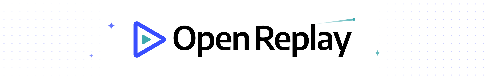
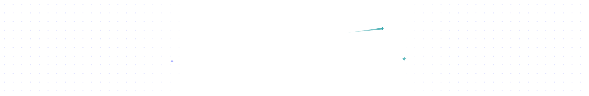
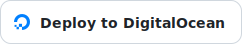
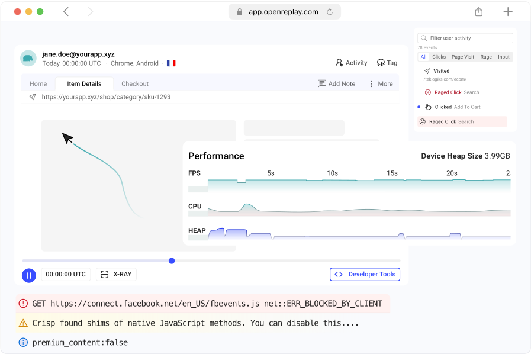

  <a href="/README_FR.md">Français</a>
  &nbsp;|&nbsp;
  <a href="/README_ESP.md">Español</a>
  &nbsp;|&nbsp;
  <a href="/README_RU.md">Русский</a>
  &nbsp;|&nbsp;
  <a href="/README_AR.md">العربية</a>

  
  

<h3 align="center">The open-source experience platform you host yourself</h3>

Session replay, cobrowsing, and product analytics — self-hosted, so your users' data never leaves your infrastructure.

  
  
  

  
  
  
  

  

OpenReplay is an open-source experience platform you host on your own infrastructure. Replay user sessions, debug with full technical context, analyze product usage, and co-browse with users live — without sending a single session to a third party. Everything OpenReplay captures stays in your cloud, fully under your control.

That makes OpenReplay a fit for teams that can't ship customer data to an external vendor: no third-party processors, no lengthy compliance reviews, and alignment with the strictest regulatory standards. It's used by engineering, product, design, and support teams at large companies in highly regulated industries.

## Why OpenReplay

- **Own your data.** Self-host on your own infrastructure (AWS, GCP, Azure, and more). Session data never leaves your security perimeter.
- **Privacy by design.** Mask, obscure, or skip any data [at capture time](https://docs.openreplay.com/en/sdk/sanitize-data/), before it ever reaches your servers. Turn on [private mode](https://docs.openreplay.com/en/sdk/private-mode/) to redact everything by default.
- **Everything in one place.** Session replay, DevTools, product analytics, and cobrowsing — instead of stitching together separate tools.
- **Lightweight.** A lightweight tracker that sends minimal data asynchronously, for very limited impact on performance.
- **Open-source.** Read the code, self-host it for free, and contribute. No black boxes.

## Features

- **[Session Replay](https://openreplay.com/product/feature/session-replay).** Relive what your users experience — where they navigate, click, hesitate, or struggle — and catch every error, slowdown, or crash along the way. Search and filter by almost any user action, session attribute, or technical event — no instrumentation required.
- **[DevTools](https://openreplay.com/product/feature/developer-tools).** Debug as if the bug happened in your own browser. Get the full context — network activity, console logs, JS errors, store actions/state, and 40+ performance metrics — to reproduce and fix issues instantly.
- **[Product Analytics](https://docs.openreplay.com/en/product-analytics/).** Know which journeys convert and where users drop off, with [funnels](https://docs.openreplay.com/en/product-analytics/funnels/), [trends](https://docs.openreplay.com/en/product-analytics/trends/), [journeys](https://docs.openreplay.com/en/product-analytics/journeys/), [heatmaps](https://docs.openreplay.com/en/product-analytics/heatmaps/), and [web analytics](https://docs.openreplay.com/en/product-analytics/web-analytics/) — all backed by the underlying session replays for full context.
- **[Cobrowsing](https://docs.openreplay.com/en/plugins/assist/).** Support users when it matters most. See their live screen, take cursor control with permission, and hop on a WebRTC call — no meeting links, downloads, or third-party screen-sharing software.
- **[Spot](https://openreplay.com/platform/spot).** A free Chrome extension that captures bugs straight from the browser. Each recording bundles the console, network, and environment details developers need to fix the issue.
- **[Mobile](https://openreplay.com/product/feature/mobile).** Native session replay for iOS, Android, and React Native apps.

## Own your data

OpenReplay was built for teams in regulated and security-conscious industries who need full control over user data.

- **Self-hosted.** Run OpenReplay entirely inside your own cloud or on-prem. No data is shared with any 3rd-party.
- **Capture-time sanitization.** Choose what to capture, obscure, or ignore so sensitive data never even reaches your servers. Mask by CSS selector, redact inputs, and sanitize network payloads. See [Data Sanitization](https://docs.openreplay.com/en/sdk/sanitize-data/).
- **Private mode.** Mask all text and inputs by default — ideal for healthcare, banking, and legal applications. See [Private Mode](https://docs.openreplay.com/en/sdk/private-mode/).
- **Ad-blocker resistant.** Because you self-host, tracking is first-party and isn't blocked by ad blockers, so you capture complete data.
- **GDPR & CCPA.** Built-in tools to sanitize sensitive data, manage exports, and honor deletion requests.
- **Access control.** Role-based access (Owner, Admin, Member) plus SSO (SAML, OIDC) for enterprise authentication.
- **SOC 2 Type II.** OpenReplay Cloud is SOC 2 Type II compliant.

## How OpenReplay compares

Most session-replay and product-analytics tools are closed-source SaaS: your users' data is captured into a vendor's multi-tenant cloud, and your control ends at a settings page. OpenReplay is open source and gives you the full range of deployment models — including options no other vendor offers — so data security and residency stay your decision.

On top of free self-hosting, you can run OpenReplay three ways: **Serverless** (usage-based, like everyone else), a fully managed **Dedicated** instance with data residency in **50+ regions**, or **Bring-Your-Own-Cloud (BYOC)**, where we deploy and manage OpenReplay inside your *own* cloud account so session data never leaves it.

| Security & privacy | OpenReplay | FullStory | LogRocket | PostHog |
| --- | :---: | :---: | :---: | :---: |
| Open-source | ✅ | ❌ | ❌ | ✅ |
| Self-host in production (free) | ✅ | ❌ | Enterprise only 1 | Deprecated 2 |
| Cloud Serverless (usage based) | ✅ | ✅ | ✅ | ✅ |
| Cloud Dedicated | **50+ regions across AWS/Azure/GCP** | ❌ | ❌ | ❌ |
| Bring-Your-Own-Cloud (BYOC) | ✅ | ❌ | ❌ | ❌ |
| Data stays in your infrastructure | ✅ | ❌ | Enterprise only | Hobby version only |
| No 3rd-party processor | ✅ | ❌ | ⚠️ | ⚠️ |
| Mask PII at capture | ✅ | ✅ | ✅ | ✅ |

1 LogRocket has a self-hosted version but for enterprise customers only. It's limited and not open-source.  
2 PostHog is open source, but its self-hosted (Kubernetes) deployment is deprecated — only a "hobby" Docker build remains, and new features ship cloud-only.

## Deploy anywhere

OpenReplay can be deployed anywhere. Start with the [Getting Started guide](https://docs.openreplay.com/en/getting-started/). All you need is a single VM on a baseline of 2 vCPUs, 8 GB of RAM, and 50 GB of storage:

- [AWS](https://docs.openreplay.com/en/deployment/deploy-aws/)
- [Google Cloud](https://docs.openreplay.com/en/deployment/deploy-gcp/)
- [Azure](https://docs.openreplay.com/en/deployment/deploy-azure/)
- [DigitalOcean](https://docs.openreplay.com/en/deployment/deploy-digitalocean/)
- [Scaleway](https://docs.openreplay.com/en/deployment/deploy-scaleway/)
- [OVHcloud](https://docs.openreplay.com/en/deployment/deploy-ovhcloud/)
- [Kubernetes (Helm)](https://docs.openreplay.com/en/deployment/deploy-kubernetes/)
- [Docker](https://docs.openreplay.com/en/deployment/deploy-docker/)
- [Ubuntu (bare metal)](https://docs.openreplay.com/en/deployment/deploy-ubuntu/)
- [From source](https://docs.openreplay.com/en/deployment/deploy-source/)

## OpenReplay Cloud

Prefer not to self-host? Run OpenReplay in our cloud:

- **Serverless** — usage-based, pay only for the sessions you record.
- **Dedicated** — a fully managed instance, in a dedicated VPC, with data residency across 50+ regions.
- **Bring-Your-Own-Cloud (BYOC)** — we run and manage OpenReplay inside your own AWS, GCP, or Azure account.

See [pricing](https://openreplay.com/pricing) for details.

## SDKs

- **Web** — a single JavaScript tracker with guides for [React](https://docs.openreplay.com/en/sdk/using-or/react/), [Next.js](https://docs.openreplay.com/en/sdk/using-or/next/), [Angular](https://docs.openreplay.com/en/sdk/using-or/angular/), [Vue](https://docs.openreplay.com/en/sdk/using-or/vue/), [Nuxt](https://docs.openreplay.com/en/sdk/using-or/nuxt/), [Svelte](https://docs.openreplay.com/en/sdk/using-or/svelte/), [Gatsby](https://docs.openreplay.com/en/sdk/using-or/gatsby/), [Remix](https://docs.openreplay.com/en/sdk/using-or/remix/), [Electron](https://docs.openreplay.com/en/sdk/using-or/electron/), or a [drop-in snippet](https://docs.openreplay.com/en/sdk/using-or/snippet/). See the [JavaScript SDK reference](https://docs.openreplay.com/en/sdk/).
- **Mobile** — native session replay for [iOS](https://docs.openreplay.com/en/ios-sdk/), [Android](https://docs.openreplay.com/en/android-sdk/), and [React Native](https://docs.openreplay.com/en/rn-sdk/) (currently in beta).

## Plugins & integrations

Get to the root cause faster by capturing application state and backend context alongside each replay.

- **State management:** [Redux](https://docs.openreplay.com/en/plugins/redux/), [VueX](https://docs.openreplay.com/en/plugins/vuex/), [Pinia](https://docs.openreplay.com/en/plugins/pinia/), [MobX](https://docs.openreplay.com/en/plugins/mobx/), [NgRx](https://docs.openreplay.com/en/plugins/ngrx/), and [Zustand](https://docs.openreplay.com/en/plugins/zustand/).
- **Network & performance:** [Fetch](https://docs.openreplay.com/en/plugins/fetch/), [Axios](https://docs.openreplay.com/en/plugins/axios/), [GraphQL](https://docs.openreplay.com/en/plugins/graphql/) (Apollo, Relay), and the [Profiler](https://docs.openreplay.com/en/plugins/profiler/).
- **Integrations:** Sync backend logs and errors with your replays to see what happened front to back — [Sentry](https://docs.openreplay.com/en/integrations/sentry/), [Datadog](https://docs.openreplay.com/en/integrations/datadog/), [Elastic](https://docs.openreplay.com/en/integrations/elastic/), [Dynatrace](https://docs.openreplay.com/en/integrations/dynatrace/), and more. Plus ticketing ([Jira](https://docs.openreplay.com/en/integrations/jira/), [GitHub](https://docs.openreplay.com/en/integrations/github/), [Zendesk](https://docs.openreplay.com/en/integrations/zendesk/), messaging ([Slack](https://docs.openreplay.com/en/integrations/slack/), [Microsoft Teams](https://docs.openreplay.com/en/integrations/msteams/)), and [Google Tag Manager](https://docs.openreplay.com/en/integrations/google-tag-manager/)).

## Documentation & resources

- [Documentation](https://docs.openreplay.com/) — guides, SDK references, and deployment instructions.
- [Getting Started](https://docs.openreplay.com/en/getting-started/) — from zero to your first session in ~30 minutes.
- [Blog](https://blog.openreplay.com/) — tutorials, comparisons, and engineering deep-dives.

## Community & support

Start with the [documentation](https://docs.openreplay.com/) to troubleshoot common issues. For more help, reach out on any of these channels:

- [Slack](https://slack.openreplay.com) — connect with our engineers and community.
- [Forum](https://forum.openreplay.com) — ask questions and browse past discussions.
- [YouTube](https://www.youtube.com/channel/UCcnWlW-5wEuuPAwjTR1Ydxw) — tutorials and past community calls.

## Contributing

We're always on the lookout for contributions, and we're glad you're considering it! Not sure where to start? Look for open issues, preferably those marked as good first issues. See our [Contributing Guide](CONTRIBUTING.md) for more details, and feel free to join our [Slack](https://slack.openreplay.com) to ask questions, discuss ideas, or connect with other contributors.

## License

This monorepo uses multiple licenses. Most of the codebase is licensed under the **AGPLv3**, some directories are licensed under **MIT**, and everything under the `ee/` directory (the Enterprise Edition) is licensed under a separate commercial license defined in [`ee/LICENSE`](/ee/LICENSE). Third-party components retain their original licenses.

See [LICENSE](/LICENSE) for the full details. Questions? Reach out to license@openreplay.com.
