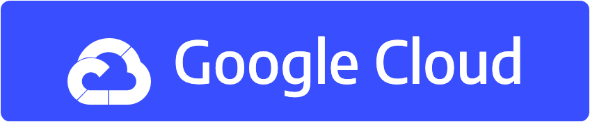
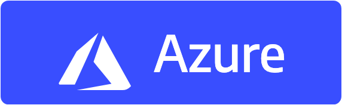

  

<h3 align="center">Session replay for developers</h3>

The most advanced open-source session replay to build delightful web apps.

  

  

  

  

  

OpenReplay is a session replay suite you can host yourself, that lets you see what users do on your web app, helping you troubleshoot issues faster. It's the only open-source alternative to products such as FullStory and LogRocket.

- **Session replay.** OpenReplay replays what users do, but not only. It also shows you what went under the hood, how your website or app behaves by capturing network activity, console logs, JS errors, store actions/state, page speed metrics, cpu/memory usage and much more.
- **Low footprint**. With a ~18KB (.gz) tracker that asynchronously sends minimal data for a very limited impact on performance.
- **Self-hosted**. No more security compliance checks, 3rd-parties processing user data. Everything OpenReplay captures stays in your cloud for a complete control over your data.
- **Privacy controls**. Fine-grained security features for sanitizing user data.
- **Easy deploy**. With support of major public cloud providers (AWS, GCP, Azure, DigitalOcean).

## Features

- **Session replay:** Lets you relive your users' experience, see where they struggle and how it affects their behavior. Each session replay is automatically analyzed based on heuristics, for easy triage.
- **DevTools:** It's like debugging in your own browser. OpenReplay provides you with the full context (network activity, JS errors, store actions/state and 40+ metrics) so you can instantly reproduce bugs and understand performance issues.
- **Assist:** Helps you support your users by seeing their live screen and instantly hopping on call (WebRTC) with them without requiring any 3rd-party screen sharing software.
- **Omni-search:** Search and filter by almost any user action/criteria, session attribute or technical event, so you can answer any question. No instrumentation required.
- **Funnels:** For surfacing the most impactful issues causing conversion and revenue loss.
- **Fine-grained privacy controls:** Choose what to capture, what to obscure or what to ignore so user data doesn't even reach your servers.
- **Plugins oriented:** Get to the root cause even faster by tracking application state (Redux, VueX, MobX, NgRx, Pinia and Zustand) and logging GraphQL queries (Apollo, Relay) and Fetch/Axios requests.
- **Integrations:** Sync your backend logs with your session replays and see what happened front-to-back. OpenReplay supports Sentry, Datadog, CloudWatch, Stackdriver, Elastic and more.

## Deployment Options

OpenReplay can be deployed anywhere. Follow our step-by-step guides for deploying it on major public clouds:

- [AWS](https://docs.openreplay.com/deployment/deploy-aws)
- [Google Cloud](https://docs.openreplay.com/deployment/deploy-gcp)
- [Azure](https://docs.openreplay.com/deployment/deploy-azure)
- [Digital Ocean](https://docs.openreplay.com/deployment/deploy-digitalocean)
- [Scaleway](https://docs.openreplay.com/deployment/deploy-scaleway)
- [OVHcloud](https://docs.openreplay.com/deployment/deploy-ovhcloud)
- [Kubernetes](https://docs.openreplay.com/deployment/deploy-kubernetes)

## OpenReplay Cloud

For those who want to simply use OpenReplay as a service, [sign up](https://app.openreplay.com/signup) for a free account on our cloud offering.

## Community Support

Please refer to the [official OpenReplay documentation](https://docs.openreplay.com/). That should help you troubleshoot common issues. For additional help, you can reach out to us on one of these channels:

- [Slack](https://slack.openreplay.com) (Connect with our engineers and community)
- [GitHub](https://github.com/openreplay/openreplay/issues) (Bug and issue reports)
- [Twitter](https://twitter.com/OpenReplayHQ) (Product updates, Great content)
- [YouTube](https://www.youtube.com/channel/UCcnWlW-5wEuuPAwjTR1Ydxw) (How-to tutorials, past Community Calls)
- [Website chat](https://openreplay.com) (Talk to us)

## Contributing

We're always on the lookout for contributions to OpenReplay, and we're glad you're considering it! Not sure where to start? Look for open issues, preferably those marked as good first issues.

See our [Contributing Guide](CONTRIBUTING.md) for more details.

Also, feel free to join our [Slack](https://slack.openreplay.com) to ask questions, discuss ideas or connect with our  contributors.

## Roadmap

Check out our [roadmap](https://www.notion.so/openreplay/Roadmap-889d2c3d968b4786ab9b281ab2394a94) and keep an eye on what's coming next. You're free to [submit](https://github.com/openreplay/openreplay/issues/new) new ideas and vote on features.

## License

This monorepo uses several licenses. See [LICENSE](/LICENSE) for more details.

## Contributors

