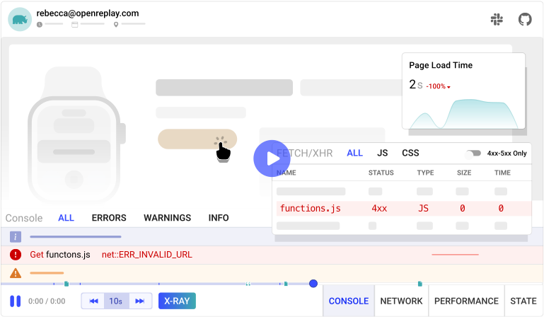

  
  

<h3 align="center">Реплей сессий для разработчиков</h3>

Наиболее продвинутое решение для воспроизведения сессий с открытым исходным кодом для создания восхитительных веб-приложений.

  

  

  

  

  

OpenReplay - это набор для воспроизведения юзер-сессий, который вы можете задеплоить у себя, позволяющий увидеть действия пользователи в вашем веб-приложении, что поможет быстрее устранить неполадки.

- **Воспроизведение сессий.** OpenReplay воспроизводит действия пользователей, и не только. Он также показывает, что происходит под капотом, как ведет себя ваш сайт или приложение, фиксируя сетевую активность, консоль, JS-ошибки, действия/состояние стейт менеджеров, показатели скорости страницы, использование процессора/памяти и многое другое.
- **Компактность**. Размером всего в ~26 КБ (.br), трекер асинхронно отправляет минимальное количество данных, оказывая очень незначительное влияние на производительность.
- **Self-hosted**. Больше никаких проверок на соответствие требованиям безопасности или обработки данных ваших пользователей третьими сторонами. Все, что фиксирует OpenReplay, остается в вашем облаке, что обеспечивает полный контроль над вашими данными.
- **Контроль над приватностью**. Тонкие настройки приватности позволяют записывать только действительно необходимые данные.
- **Легкая установка**. Мы поддерживаем всех крупных поставщиков облачных услуг (AWS, GCP, Azure, DigitalOcean).

## Особенности

- **Session Replay:** Позволяет повторить опыт пользователей, увидеть, где они испытывают трудности и как это влияет на их поведение. Каждый повтор сеанса автоматически анализируется эвристиками, что значительно облегчает сортировку и поиск проблемных сессий.
- **DevTools:** Прямо как отладка в вашем собственном браузере. OpenReplay предоставляет вам полный контекст (сетевая активность, JS ошибки, действия/состояние стейт менеджеров и более 40 метрик), чтобы вы могли мгновенно воспроизвести ошибки и найти проблемы с производительностью.
- **Assist:** Помогает вам поддерживать ваших пользователей, видя их экран в настоящем времени и мгновенно переходя на звонок (WebRTC) с ними, не требуя стороннего программного обеспечения для совместного просмотра экрана.
- **Omni-search:** Поиск и фильтрация практически любого действия пользователя/критерия, атрибута сессии или технического события, чтобы вы могли ответить на любой вопрос. Не требуется инструментирование.
- **Воронки:** Для выявления наиболее влияющих на конверсию и потерю дохода проблем.
- **Тонкая настройка приватности:** Выбирайте, что записывать, а что игнорировать, чтобы данные пользователя даже не достигали ваших серверов.
- **Ориентирован на плагины:** Быстрее доберитесь до корня проблемы, отслеживая состояние приложения (Redux, VueX, MobX, NgRx, Pinia, and Zustand) и регистрируя запросы GraphQL (Apollo, Relay).
- **Интеграции:** Синхронизируйте ваш пайплайн с записями сессий и узнайте, что произошло от начала до конца. OpenReplay поддерживает Sentry, Datadog, CloudWatch, Stackdriver, Elastic и другие.

## Варианты развертывания

OpenReplay можно развернуть в любом месте. Следуйте нашим пошаговым руководствам по развертыванию на основных публичных облаках:

- [AWS](https://docs.openreplay.com/deployment/deploy-aws)
- [Google Cloud](https://docs.openreplay.com/deployment/deploy-gcp)
- [Azure](https://docs.openreplay.com/deployment/deploy-azure)
- [Digital Ocean](https://docs.openreplay.com/deployment/deploy-digitalocean)
- [Scaleway](https://docs.openreplay.com/deployment/deploy-scaleway)
- [OVHcloud](https://docs.openreplay.com/deployment/deploy-ovhcloud)
- [Kubernetes](https://docs.openreplay.com/deployment/deploy-kubernetes)

## OpenReplay Cloud

Для тех, кто просто хочет использовать OpenReplay как сервис, [зарегистрируйте](https://app.openreplay.com/signup) бесплатную учетную запись в нашем приложении.

## Поддержка сообщества

Пожалуйста, обратитесь к [официальной документации OpenReplay](https://docs.openreplay.com/). Это поможет вам решить распространенные проблемы. Для дополнительной помощи, вы можете связаться с нами через один из этих каналов:

- [Slack](https://slack.openreplay.com) (Свяжитесь с нашими инженерами и сообществом)
- [GitHub](https://github.com/openreplay/openreplay/issues) (Отчеты о багах и проблемах)
- [Twitter](https://twitter.com/OpenReplayHQ) (Обновления продукта, отличный контент)
- [YouTube](https://www.youtube.com/channel/UCcnWlW-5wEuuPAwjTR1Ydxw) (Учебные пособия, прошлые общие звонки)
- [Чат на веб-сайте](https://openreplay.com) (Общайтесь с нами)

## Содействие

Мы всегда рады любой помощи в создании OpenReplay, и мы рады услышать ваши мысли! Не уверены, с чего начать? Ищите открытые задачи, особенно те, которые отмечены как "хорошие первые задачи".

Смотрите наше [руководство по содействию](CONTRIBUTING.md) для более подробной информации.

Также не стесняйтесь присоединиться к нашему [Slack](https://slack.openreplay.com), чтобы задавать вопросы, обсуждать идеи или связываться с нашими участниками.

## План развития

Ознакомьтесь с нашим [планом развития](https://www.notion.so/openreplay/Roadmap-889d2c3d968b4786ab9b281ab2394a94) и следите за тем, что будет далее. Вы можете свободно [предложить](https://github.com/openreplay/openreplay/issues/new) новые идеи и голосовать за функции.

## Лицензия

В этом монорепозитории используются разные лицензии. См. [LICENSE](/LICENSE) для получения более подробной информации.
