# API v2 (uvicorn)

The API service is responsible for handling request from the frontend
where customers access features of openreplay in a graphical way. The
users of that frontend are managers, and developpers, in other words: 
openreplay customers.

End-users' frontends, that is, customers of customers of openreplay,
send data to openreplay backend that is written in Go.

The API communicate with several services, including the database
PostgreSQL; in the entreprise edition openreplay rely also on
ClickHouse.

```mermaid
---
title: openreplay big picture
---
flowchart LR
    customer["Customer 😎"]
	enduser["User 😇"]
	frontend["frontend 📊"]
	customer --> frontend
	frontend --> API
	API --> PostgreSQL
	API --> ClickHouse
	Backend --> PostgreSQL
	Backend --> ClickHouse
	API --> Backend
	enduser --> Backend
```



## Glossary

- API service: the application of the code in this directory;
- Frontend: the ReactJS application that communicate with API;
- Client: most of the time a synonym of frontend; it may be another kind of
  client authenticated with API service;
- Customer: the users of the frontend;
- End-users: the users of the frontend of openreplay customers;
- Backend: the code that process the data coming from the frontends used by end-users;*

## Getting started

```sh
$ ./venv
% make init
% make check-coverage
% make serve
```

## Basics

### HTTP/1.1 text

#### Request

```http
GET /folder/object-type/unique-identifier/complement HTTP/1.1
Header-One: Header Value One
Header-Two: Header Value Two

{"hello": "world"}
```

#### Response

```http
HTTP/1.1 200 OK
Another-Header-One: Another Header Value One

{"status": "ok"}
```

### uvicorn

The API service is built on top of `uvicorn` HTTP server. We use
`uvicorn` single entrypoint: a function that receive three arguments:

- `scope`, a dictionary representing a part of what was sent by the
  frontend: the HTTP request line, and headers;
- `receive()`, a function that lazily read the body of an HTTP request
  also known as a generator of the HTTP requests body;
- `send(dict)`, a function to reply to the user. `dict` follow a
  precise protocol documented in Python's ASGI standard
  specification. As part of `orpy`, it is not useful to know the
  details for most use-cases such as JSON over HTTP response.

That is somewhat a lil complex... BUT ninety-nine percent of the time:

1. The client will send an HTTP request with a JSON body that is
   smaller than one 1MB, in other words that is smaller than volatile
   memory.

2. The HTTP request is dispatched based on the path component of the
   HTTP request, that from the above HTTP text request
   `/folder/object-type/unique-identifier/...`

   Note: Path patterns should build a well formed and nice tree: the
   root unfold into a couple of nodes, then each child unfold into a
   couple more, that may take into account type casting such as
   integer that may apply to unique identifiers.

   Hence the core of uvicorn `scope` handler that is the function
   `orpy.base.orpy` will match HTTP path using placeholders, that is
   known routes.

3. A route is identified with a HTTP method, a path pattern, and optionally
   a pydantic Schema;

4. A route should explicitly do three types of validations:

   a. Container validation e.g. the body is propery JSON, CSV, XML... This is
      most of the time done using a parser: if the parser succeed, then it is
      the good container.

   b. Schema validation e.g. using pydantic, or JSON Schema;

   c. Shallow validation e.g. check that `password`, and
	  `confirmation` are the same, check that `password` is strong
	  enough, check that `token` is signed using the expected
	  signature.

	  Any validation that does not involve network, or disk io falls
	  into that category.

   d. Deep validation e.g. while registring a new user, the e-mail must be unique.

      Note: sometime database transaction must span deep validation, and create,
      update, or delete.

   In case of validation error, the expected error code is 400
   aka. bad request.

5. The Request processing per-se; that may include one or more disk,
   or network io.  Zero or more explicit database transactions may be
   necessary. That is known as "business logic" or "product", or
   "feature".

6. Response generation

### orpy

Like described above, most requests look alike. Hence there is a couple of helpers
to make it obvious, while a little boilerplate-ish in some cases, it handles 99% of
the cases, and there is room for expanding without hurting usability.

A route in orpy looks like the following:

```
@route("GET", "stats", "path", _, "review")
async def view_get_stats_path_review(uid):
    # do something iwht method `uid`
	out = await do_something(orpy.application.get(), uid)
	return 200, [(b"content-type", "application/javascript")], out

```

### Tests

Of primary importance, and as a matter of facts a good productivty
kicker to get into the flow: tests.

Here is a test for a health route. The is expected return 200 and as
payload a JSON object that is empty:

```python
from orpy.base import orpy

@pytest.mark.asyncio
async def test_view_get_health():
    scope = {
        "type": "http",
        "path": "/health/",
        "method": "GET",
        "headers": [(b'content-type', b'application/json')],
    }
    ok = [False]
    await orpy(scope, orpy.receive_body(b'{}'), orpy.send_ok(ok, 200, [], {}))
    assert ok[0]
```

Notes:

- The variable `orpy` is `orpy.base.orpy`;
- The test construct a `scope` with just the necessary keys;
- The use or `receive_empty` to yield an empty body in `context.body`;
- Then `send_ok` will assert that the code is the one that is
  expected, that all required headers are present, and response's body
  is the same;
- Do not forget to assert `ok[0]` is truthy to make sure that
  something actually happened;

Here is another that also test the router:

```python
from orpy import base as orpy


@pytest.mark.asyncio
async def test_task_reset_password_link_unknown_email():
    # Setup, jump to definition to know more about why 
    await orpy.orpy({"type": "lifespan"}, None, None)
    orpy.context.set(orpy.Context(orpy.application.get(), None, None, None))
    # Given
    email = "example@example.example"
    # When
    out = await _task_reset_password_link(email)
    # Then
    assert not out
    # Clean up
    await orpy.context.get().application.database.close()
```

## Link to documentation

- psycopg3
- httpx
- https://docs.python.org/3/library/unittest.mock.html
