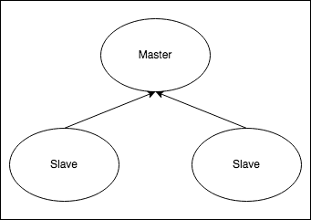

# Redis<sup>TM</sup> Chart packaged by Bitnami

[Redis<sup>TM</sup>](http://redis.io/) is an advanced key-value cache and store. It is often referred to as a data structure server since keys can contain strings, hashes, lists, sets, sorted sets, bitmaps and hyperloglogs.

Disclaimer: REDIS® is a registered trademark of Redis Labs Ltd.Any rights therein are reserved to Redis Labs Ltd. Any use by Bitnami is for referential purposes only and does not indicate any sponsorship, endorsement, or affiliation between Redis Labs Ltd.

## TL;DR

```bash
$ helm repo add bitnami https://charts.bitnami.com/bitnami
$ helm install my-release bitnami/redis
```

## Introduction

This chart bootstraps a [Redis<sup>TM</sup>](https://github.com/bitnami/bitnami-docker-redis) deployment on a [Kubernetes](http://kubernetes.io) cluster using the [Helm](https://helm.sh) package manager.

Bitnami charts can be used with [Kubeapps](https://kubeapps.com/) for deployment and management of Helm Charts in clusters. This chart has been tested to work with NGINX Ingress, cert-manager, fluentd and Prometheus on top of the [BKPR](https://kubeprod.io/).

### Choose between Redis<sup>TM</sup> Helm Chart and Redis<sup>TM</sup> Cluster Helm Chart

You can choose any of the two Redis<sup>TM</sup> Helm charts for deploying a Redis<sup>TM</sup> cluster.
While [Redis<sup>TM</sup> Helm Chart](https://github.com/bitnami/charts/tree/master/bitnami/redis) will deploy a master-slave cluster using Redis<sup>TM</sup> Sentinel, the [Redis<sup>TM</sup> Cluster Helm Chart](https://github.com/bitnami/charts/tree/master/bitnami/redis-cluster) will deploy a Redis<sup>TM</sup> Cluster topology with sharding.
The main features of each chart are the following:

| Redis<sup>TM</sup>                                     | Redis<sup>TM</sup> Cluster                                             |
|--------------------------------------------------------|------------------------------------------------------------------------|
| Supports multiple databases                            | Supports only one database. Better if you have a big dataset           |
| Single write point (single master)                     | Multiple write points (multiple masters)                               |
|  |  |

## Prerequisites

- Kubernetes 1.12+
- Helm 3.1.0
- PV provisioner support in the underlying infrastructure

## Installing the Chart

To install the chart with the release name `my-release`:

```bash
$ helm install my-release bitnami/redis
```

The command deploys Redis<sup>TM</sup> on the Kubernetes cluster in the default configuration. The [Parameters](#parameters) section lists the parameters that can be configured during installation.

> **Tip**: List all releases using `helm list`

## Uninstalling the Chart

To uninstall/delete the `my-release` deployment:

```bash
$ helm delete my-release
```

The command removes all the Kubernetes components associated with the chart and deletes the release.

## Parameters

The following table lists the configurable parameters of the Redis<sup>TM</sup> chart and their default values.

| Parameter                                             | Description                                                                                                                                         | Default                                                 |
|:------------------------------------------------------|:----------------------------------------------------------------------------------------------------------------------------------------------------|:--------------------------------------------------------|
| `global.imageRegistry`                                | Global Docker image registry                                                                                                                        | `nil`                                                   |
| `global.imagePullSecrets`                             | Global Docker registry secret names as an array                                                                                                     | `[]` (does not add image pull secrets to deployed pods) |
| `global.storageClass`                                 | Global storage class for dynamic provisioning                                                                                                       | `nil`                                                   |
| `global.redis.password`                               | Redis<sup>TM</sup> password (overrides `password`)                                                                                                  | `nil`                                                   |
| `image.registry`                                      | Redis<sup>TM</sup> Image registry                                                                                                                   | `docker.io`                                             |
| `image.repository`                                    | Redis<sup>TM</sup> Image name                                                                                                                       | `bitnami/redis`                                         |
| `image.tag`                                           | Redis<sup>TM</sup> Image tag                                                                                                                        | `{TAG_NAME}`                                            |
| `image.pullPolicy`                                    | Image pull policy                                                                                                                                   | `IfNotPresent`                                          |
| `image.pullSecrets`                                   | Specify docker-registry secret names as an array                                                                                                    | `nil`                                                   |
| `nameOverride`                                        | String to partially override redis.fullname template with a string (will prepend the release name)                                                  | `nil`                                                   |
| `fullnameOverride`                                    | String to fully override redis.fullname template with a string                                                                                      | `nil`                                                   |
| `cluster.enabled`                                     | Use master-slave topology                                                                                                                           | `true`                                                  |
| `cluster.slaveCount`                                  | Number of slaves                                                                                                                                    | `2`                                                     |
| `existingSecret`                                      | Name of existing secret object (for password authentication)                                                                                        | `nil`                                                   |
| `existingSecretPasswordKey`                           | Name of key containing password to be retrieved from the existing secret                                                                            | `nil`                                                   |
| `usePassword`                                         | Use password                                                                                                                                        | `true`                                                  |
| `usePasswordFile`                                     | Mount passwords as files instead of environment variables                                                                                           | `false`                                                 |
| `password`                                            | Redis<sup>TM</sup> password (ignored if existingSecret set)                                                                                         | Randomly generated                                      |
| `configmap`                                           | Additional common Redis<sup>TM</sup> node configuration (this value is evaluated as a template)                                                     | See values.yaml                                         |
| `clusterDomain`                                       | Kubernetes DNS Domain name to use                                                                                                                   | `cluster.local`                                         |
| `extraVolumes`                                        | Array of extra volumes to be added to master & slave nodes (evaluated as a template)                                                                | `[]`                                                    |
| `extraVolumeMounts`                                   | Array of extra volume mounts to be added to master & slave nodes (evaluated as a template)                                                          | `[]`                                                    |
| `networkPolicy.enabled`                               | Enable NetworkPolicy                                                                                                                                | `false`                                                 |
| `networkPolicy.allowExternal`                         | Don't require client label for connections                                                                                                          | `true`                                                  |
| `networkPolicy.ingressNSMatchLabels`                  | Allow connections from other namespaces                                                                                                             | `{}`                                                    |
| `networkPolicy.ingressNSPodMatchLabels`               | For other namespaces match by pod labels and namespace labels                                                                                       | `{}`                                                    |
| `securityContext.*`                                   | Other pod security context to be included as-is in the pod spec                                                                                     | `{}`                                                    |
| `securityContext.enabled`                             | Enable security context (both redis master and slave pods)                                                                                          | `true`                                                  |
| `securityContext.fsGroup`                             | Group ID for the container (both redis master and slave pods)                                                                                       | `1001`                                                  |
| `containerSecurityContext.*`                          | Other container security context to be included as-is in the container spec                                                                         | `{}`                                                    |
| `containerSecurityContext.enabled`                    | Enable security context (both redis master and slave containers)                                                                                    | `true`                                                  |
| `containerSecurityContext.runAsUser`                  | User ID for the container (both redis master and slave containers)                                                                                  | `1001`                                                  |
| `serviceAccount.create`                               | Specifies whether a ServiceAccount should be created                                                                                                | `false`                                                 |
| `serviceAccount.name`                                 | The name of the ServiceAccount to create                                                                                                            | Generated using the fullname template                   |
| `serviceAccount.annotations`                          | Specifies annotations to add to ServiceAccount.                                                                                                     | `nil`                                                   |
| `rbac.create`                                         | Specifies whether RBAC resources should be created                                                                                                  | `false`                                                 |
| `rbac.role.rules`                                     | Rules to create                                                                                                                                     | `[]`                                                    |
| `metrics.enabled`                                     | Start a side-car prometheus exporter                                                                                                                | `false`                                                 |
| `metrics.image.registry`                              | Redis<sup>TM</sup> exporter image registry                                                                                                          | `docker.io`                                             |
| `metrics.image.repository`                            | Redis<sup>TM</sup> exporter image name                                                                                                              | `bitnami/redis-exporter`                                |
| `metrics.image.tag`                                   | Redis<sup>TM</sup> exporter image tag                                                                                                               | `{TAG_NAME}`                                            |
| `metrics.image.pullPolicy`                            | Image pull policy                                                                                                                                   | `IfNotPresent`                                          |
| `metrics.image.pullSecrets`                           | Specify docker-registry secret names as an array                                                                                                    | `nil`                                                   |
| `metrics.extraArgs`                                   | Extra arguments for the binary; possible values [here](https://github.com/oliver006/redis_exporter#flags)                                           | {}                                                      |
| `metrics.podLabels`                                   | Additional labels for Metrics exporter pod                                                                                                          | {}                                                      |
| `metrics.podAnnotations`                              | Additional annotations for Metrics exporter pod                                                                                                     | {}                                                      |
| `metrics.resources`                                   | Exporter resource requests/limit                                                                                                                    | Memory: `256Mi`, CPU: `100m`                            |
| `metrics.serviceMonitor.enabled`                      | if `true`, creates a Prometheus Operator ServiceMonitor (also requires `metrics.enabled` to be `true`)                                              | `false`                                                 |
| `metrics.serviceMonitor.namespace`                    | Optional namespace which Prometheus is running in                                                                                                   | `nil`                                                   |
| `metrics.serviceMonitor.interval`                     | How frequently to scrape metrics (use by default, falling back to Prometheus' default)                                                              | `nil`                                                   |
| `metrics.serviceMonitor.selector`                     | Default to kube-prometheus install (CoreOS recommended), but should be set according to Prometheus install                                          | `{ prometheus: kube-prometheus }`                       |
| `metrics.serviceMonitor.relabelings`                  | ServiceMonitor relabelings. Value is evaluated as a template                                                                                        | `[]`                                                    |
| `metrics.serviceMonitor.metricRelabelings`            | ServiceMonitor metricRelabelings. Value is evaluated as a template                                                                                  | `[]`                                                    |
| `metrics.service.type`                                | Kubernetes Service type (redis metrics)                                                                                                             | `ClusterIP`                                             |
| `metrics.service.externalTrafficPolicy`               | External traffic policy (when service type is LoadBalancer)                                                                                         | `Cluster`                                               |
| `metrics.service.annotations`                         | Annotations for the services to monitor  (redis master and redis slave service)                                                                     | {}                                                      |
| `metrics.service.labels`                              | Additional labels for the metrics service                                                                                                           | {}                                                      |
| `metrics.service.loadBalancerIP`                      | loadBalancerIP if redis metrics service type is `LoadBalancer`                                                                                      | `nil`                                                   |
| `metrics.priorityClassName`                           | Metrics exporter pod priorityClassName                                                                                                              | `nil`                                                   |
| `metrics.prometheusRule.enabled`                      | Set this to true to create prometheusRules for Prometheus operator                                                                                  | `false`                                                 |
| `metrics.prometheusRule.additionalLabels`             | Additional labels that can be used so prometheusRules will be discovered by Prometheus                                                              | `{}`                                                    |
| `metrics.prometheusRule.namespace`                    | namespace where prometheusRules resource should be created                                                                                          | Same namespace as redis                                 |
| `metrics.prometheusRule.rules`                        | [rules](https://prometheus.io/docs/prometheus/latest/configuration/alerting_rules/) to be created, check values for an example.                     | `[]`                                                    |
| `metrics.redisTargetHost`                             | way to specify an alternative redis hostname, if you set a local endpoint in hostAliases to match specific redis server certificate CN/SAN for example.
   | `localhost`                                             |
| `persistence.existingClaim`                           | Provide an existing PersistentVolumeClaim                                                                                                           | `nil`                                                   |
| `master.persistence.enabled`                          | Use a PVC to persist data (master node)                                                                                                             | `true`                                                  |
| `master.hostAliases`                                  | Add deployment host aliases                                                                                                                         | `[]`                                                    |
| `master.persistence.path`                             | Path to mount the volume at, to use other images                                                                                                    | `/data`                                                 |
| `master.persistence.subPath`                          | Subdirectory of the volume to mount at                                                                                                              | `""`                                                    |
| `master.persistence.storageClass`                     | Storage class of backing PVC                                                                                                                        | `generic`                                               |
| `master.persistence.accessModes`                      | Persistent Volume Access Modes                                                                                                                      | `[ReadWriteOnce]`                                       |
| `master.persistence.size`                             | Size of data volume                                                                                                                                 | `8Gi`                                                   |
| `master.persistence.matchLabels`                      | matchLabels persistent volume selector                                                                                                              | `{}`                                                    |
| `master.persistence.matchExpressions`                 | matchExpressions persistent volume selector                                                                                                         | `{}`                                                    |
| `master.persistence.volumes`                          | Additional volumes without creating PVC                                                                                                             | `{}`                                                    |
| `master.statefulset.labels`                           | Additional labels for redis master StatefulSet                                                                                                      | `{}`                                                    |
| `master.statefulset.annotations`                      | Additional annotations for redis master StatefulSet                                                                                                 | `{}`                                                    |
| `master.statefulset.updateStrategy`                   | Update strategy for StatefulSet                                                                                                                     | onDelete                                                |
| `master.statefulset.rollingUpdatePartition`           | Partition update strategy                                                                                                                           | `nil`                                                   |
| `master.statefulset.volumeClaimTemplates.labels`      | Additional labels for redis master StatefulSet volumeClaimTemplates                                                                                 | `{}`                                                    |
| `master.statefulset.volumeClaimTemplates.annotations` | Additional annotations for redis master StatefulSet volumeClaimTemplates                                                                            | `{}`                                                    |
| `master.podLabels`                                    | Additional labels for Redis<sup>TM</sup> master pod                                                                                                 | {}                                                      |
| `master.podAnnotations`                               | Additional annotations for Redis<sup>TM</sup> master pod                                                                                            | {}                                                      |
| `master.extraEnvVars`                                 | Additional Environment Variables passed to the pod of the master's stateful set set                                                                 | `[]`                                                    |
| `master.extraEnvVarCMs`                               | Additional Environment Variables  ConfigMappassed to the pod of the master's stateful set set                                                       | `[]`                                                    |
| `master.extraEnvVarsSecret`                           | Additional Environment Variables Secret passed to the master's stateful set                                                                         | `[]`                                                    |
| `master.extraVolumes`                                 | Array of extra volumes to be added to master pod (evaluated as a template)                                                                          | `[]`                                                    |
| `master.extraVolumeMounts`                            | Array of extra volume mounts to be added to master pod (evaluated as a template)                                                                    | `[]`                                                    |
| `podDisruptionBudget.enabled`                         | Pod Disruption Budget toggle                                                                                                                        | `false`                                                 |
| `podDisruptionBudget.minAvailable`                    | Minimum available pods                                                                                                                              | `1`                                                     |
| `podDisruptionBudget.maxUnavailable`                  | Maximum unavailable                                                                                                                                 | `nil`                                                   |
| `redisPort`                                           | Redis<sup>TM</sup> port (in both master and slaves)                                                                                                 | `6379`                                                  |
| `tls.enabled`                                         | Enable TLS support for replication traffic                                                                                                          | `false`                                                 |
| `tls.authClients`                                     | Require clients to authenticate or not                                                                                                              | `true`                                                  |
| `tls.certificatesSecret`                              | Name of the secret that contains the certificates                                                                                                   | `nil`                                                   |
| `tls.certFilename`                                    | Certificate filename                                                                                                                                | `nil`                                                   |
| `tls.certKeyFilename`                                 | Certificate key filename                                                                                                                            | `nil`                                                   |
| `tls.certCAFilename`                                  | CA Certificate filename                                                                                                                             | `nil`                                                   |
| `tls.dhParamsFilename`                                | DH params (in order to support DH based ciphers)                                                                                                    | `nil`                                                   |
| `master.command`                                      | Redis<sup>TM</sup> master entrypoint string. The command `redis-server` is executed if this is not provided. Note this is prepended with `exec`     | `/run.sh`                                               |
| `master.preExecCmds`                                  | Text to inset into the startup script immediately prior to `master.command`. Use this if you need to run other ad-hoc commands as part of startup   | `nil`                                                   |
| `master.configmap`                                    | Additional Redis<sup>TM</sup> configuration for the master nodes (this value is evaluated as a template)                                            | `nil`                                                   |
| `master.disableCommands`                              | Array of Redis<sup>TM</sup> commands to disable (master)                                                                                            | `["FLUSHDB", "FLUSHALL"]`                               |
| `master.extraFlags`                                   | Redis<sup>TM</sup> master additional command line flags                                                                                             | []                                                      |
| `master.nodeSelector`                                 | Redis<sup>TM</sup> master Node labels for pod assignment                                                                                            | {"beta.kubernetes.io/arch": "amd64"}                    |
| `master.tolerations`                                  | Toleration labels for Redis<sup>TM</sup> master pod assignment                                                                                      | []                                                      |
| `master.affinity`                                     | Affinity settings for Redis<sup>TM</sup> master pod assignment                                                                                      | {}                                                      |
| `master.schedulerName`                                | Name of an alternate scheduler                                                                                                                      | `nil`                                                   |
| `master.service.type`                                 | Kubernetes Service type (redis master)                                                                                                              | `ClusterIP`                                             |
| `master.service.externalTrafficPolicy`                | External traffic policy (when service type is LoadBalancer)                                                                                         | `Cluster`                                               |
| `master.service.port`                                 | Kubernetes Service port (redis master)                                                                                                              | `6379`                                                  |
| `master.service.nodePort`                             | Kubernetes Service nodePort (redis master)                                                                                                          | `nil`                                                   |
| `master.service.annotations`                          | annotations for redis master service                                                                                                                | {}                                                      |
| `master.service.labels`                               | Additional labels for redis master service                                                                                                          | {}                                                      |
| `master.service.loadBalancerIP`                       | loadBalancerIP if redis master service type is `LoadBalancer`                                                                                       | `nil`                                                   |
| `master.service.loadBalancerSourceRanges`             | loadBalancerSourceRanges if redis master service type is `LoadBalancer`                                                                             | `nil`                                                   |
| `master.resources`                                    | Redis<sup>TM</sup> master CPU/Memory resource requests/limits                                                                                       | Memory: `256Mi`, CPU: `100m`                            |
| `master.livenessProbe.enabled`                        | Turn on and off liveness probe (redis master pod)                                                                                                   | `true`                                                  |
| `master.livenessProbe.initialDelaySeconds`            | Delay before liveness probe is initiated (redis master pod)                                                                                         | `5`                                                     |
| `master.livenessProbe.periodSeconds`                  | How often to perform the probe (redis master pod)                                                                                                   | `5`                                                     |
| `master.livenessProbe.timeoutSeconds`                 | When the probe times out (redis master pod)                                                                                                         | `5`                                                     |
| `master.livenessProbe.successThreshold`               | Minimum consecutive successes for the probe to be considered successful after having failed (redis master pod)                                      | `1`                                                     |
| `master.livenessProbe.failureThreshold`               | Minimum consecutive failures for the probe to be considered failed after having succeeded.                                                          | `5`                                                     |
| `master.readinessProbe.enabled`                       | Turn on and off readiness probe (redis master pod)                                                                                                  | `true`                                                  |
| `master.readinessProbe.initialDelaySeconds`           | Delay before readiness probe is initiated (redis master pod)                                                                                        | `5`                                                     |
| `master.readinessProbe.periodSeconds`                 | How often to perform the probe (redis master pod)                                                                                                   | `5`                                                     |
| `master.readinessProbe.timeoutSeconds`                | When the probe times out (redis master pod)                                                                                                         | `1`                                                     |
| `master.readinessProbe.successThreshold`              | Minimum consecutive successes for the probe to be considered successful after having failed (redis master pod)                                      | `1`                                                     |
| `master.readinessProbe.failureThreshold`              | Minimum consecutive failures for the probe to be considered failed after having succeeded.                                                          | `5`                                                     |
| `master.shareProcessNamespace`                        | Redis<sup>TM</sup> Master pod `shareProcessNamespace` option. Enables /pause reap zombie PIDs.                                                      | `false`                                                 |
| `master.priorityClassName`                            | Redis<sup>TM</sup> Master pod priorityClassName                                                                                                     | `nil`                                                   |
| `volumePermissions.enabled`                           | Enable init container that changes volume permissions in the registry (for cases where the default k8s `runAsUser` and `fsUser` values do not work) | `false`                                                 |
| `volumePermissions.image.registry`                    | Init container volume-permissions image registry                                                                                                    | `docker.io`                                             |
| `volumePermissions.image.repository`                  | Init container volume-permissions image name                                                                                                        | `bitnami/bitnami-shell`                                 |
| `volumePermissions.image.tag`                         | Init container volume-permissions image tag                                                                                                         | `"10"`                                                  |
| `volumePermissions.image.pullPolicy`                  | Init container volume-permissions image pull policy                                                                                                 | `Always`                                                |
| `volumePermissions.resources       `                  | Init container volume-permissions CPU/Memory resource requests/limits                                                                               | {}                                                      |
| `volumePermissions.securityContext.*`                 | Security context of the init container                                                                                                              | `{}`                                                    |
| `volumePermissions.securityContext.runAsUser`         | UserID for the init container (when facing issues in OpenShift or uid unknown, try value "auto")                                                    | 0                                                       |
| `slave.hostAliases`                                   | Add deployment host aliases                                                                                                                         | `[]`                                                    |
| `slave.service.type`                                  | Kubernetes Service type (redis slave)                                                                                                               | `ClusterIP`                                             |
| `slave.service.externalTrafficPolicy`                 | External traffic policy (when service type is LoadBalancer)                                                                                         | `Cluster`                                               |
| `slave.service.nodePort`                              | Kubernetes Service nodePort (redis slave)                                                                                                           | `nil`                                                   |
| `slave.service.annotations`                           | annotations for redis slave service                                                                                                                 | {}                                                      |
| `slave.service.labels`                                | Additional labels for redis slave service                                                                                                           | {}                                                      |
| `slave.service.port`                                  | Kubernetes Service port (redis slave)                                                                                                               | `6379`                                                  |
| `slave.service.loadBalancerIP`                        | LoadBalancerIP if Redis<sup>TM</sup> slave service type is `LoadBalancer`                                                                           | `nil`                                                   |
| `slave.service.loadBalancerSourceRanges`              | loadBalancerSourceRanges if Redis<sup>TM</sup> slave service type is `LoadBalancer`                                                                 | `nil`                                                   |
| `slave.command`                                       | Redis<sup>TM</sup> slave entrypoint string. The command `redis-server` is executed if this is not provided. Note this is prepended with `exec`      | `/run.sh`                                               |
| `slave.preExecCmds`                                   | Text to inset into the startup script immediately prior to `slave.command`. Use this if you need to run other ad-hoc commands as part of startup    | `nil`                                                   |
| `slave.configmap`                                     | Additional Redis<sup>TM</sup> configuration for the slave nodes (this value is evaluated as a template)                                             | `nil`                                                   |
| `slave.disableCommands`                               | Array of Redis<sup>TM</sup> commands to disable (slave)                                                                                             | `[FLUSHDB, FLUSHALL]`                                   |
| `slave.extraFlags`                                    | Redis<sup>TM</sup> slave additional command line flags                                                                                              | `[]`                                                    |
| `slave.livenessProbe.enabled`                         | Turn on and off liveness probe (redis slave pod)                                                                                                    | `true`                                                  |
| `slave.livenessProbe.initialDelaySeconds`             | Delay before liveness probe is initiated (redis slave pod)                                                                                          | `5`                                                     |
| `slave.livenessProbe.periodSeconds`                   | How often to perform the probe (redis slave pod)                                                                                                    | `5`                                                     |
| `slave.livenessProbe.timeoutSeconds`                  | When the probe times out (redis slave pod)                                                                                                          | `5`                                                     |
| `slave.livenessProbe.successThreshold`                | Minimum consecutive successes for the probe to be considered successful after having failed (redis slave pod)                                       | `1`                                                     |
| `slave.livenessProbe.failureThreshold`                | Minimum consecutive failures for the probe to be considered failed after having succeeded.                                                          | `5`                                                     |
| `slave.readinessProbe.enabled`                        | Turn on and off slave.readiness probe (redis slave pod)                                                                                             | `true`                                                  |
| `slave.readinessProbe.initialDelaySeconds`            | Delay before slave.readiness probe is initiated (redis slave pod)                                                                                   | `5`                                                     |
| `slave.readinessProbe.periodSeconds`                  | How often to perform the probe (redis slave pod)                                                                                                    | `5`                                                     |
| `slave.readinessProbe.timeoutSeconds`                 | When the probe times out (redis slave pod)                                                                                                          | `1`                                                     |
| `slave.readinessProbe.successThreshold`               | Minimum consecutive successes for the probe to be considered successful after having failed (redis slave pod)                                       | `1`                                                     |
| `slave.readinessProbe.failureThreshold`               | Minimum consecutive failures for the probe to be considered failed after having succeeded. (redis slave pod)                                        | `5`                                                     |
| `slave.shareProcessNamespace`                         | Redis<sup>TM</sup> slave pod `shareProcessNamespace` option. Enables /pause reap zombie PIDs.                                                       | `false`                                                 |
| `slave.persistence.enabled`                           | Use a PVC to persist data (slave node)                                                                                                              | `true`                                                  |
| `slave.persistence.path`                              | Path to mount the volume at, to use other images                                                                                                    | `/data`                                                 |
| `slave.persistence.subPath`                           | Subdirectory of the volume to mount at                                                                                                              | `""`                                                    |
| `slave.persistence.storageClass`                      | Storage class of backing PVC                                                                                                                        | `generic`                                               |
| `slave.persistence.accessModes`                       | Persistent Volume Access Modes                                                                                                                      | `[ReadWriteOnce]`                                       |
| `slave.persistence.size`                              | Size of data volume                                                                                                                                 | `8Gi`                                                   |
| `slave.persistence.matchLabels`                       | matchLabels persistent volume selector                                                                                                              | `{}`                                                    |
| `slave.persistence.matchExpressions`                  | matchExpressions persistent volume selector                                                                                                         | `{}`                                                    |
| `slave.statefulset.labels`                            | Additional labels for redis slave StatefulSet                                                                                                       | `{}`                                                    |
| `slave.statefulset.annotations`                       | Additional annotations for redis slave StatefulSet                                                                                                  | `{}`                                                    |
| `slave.statefulset.updateStrategy`                    | Update strategy for StatefulSet                                                                                                                     | onDelete                                                |
| `slave.statefulset.rollingUpdatePartition`            | Partition update strategy                                                                                                                           | `nil`                                                   |
| `slave.statefulset.volumeClaimTemplates.labels`       | Additional labels for redis slave StatefulSet volumeClaimTemplates                                                                                  | `{}`                                                    |
| `slave.statefulset.volumeClaimTemplates.annotations`  | Additional annotations for redis slave StatefulSet volumeClaimTemplates                                                                             | `{}`                                                    |
| `slave.extraEnvVars`                                  | Additional Environment Variables passed to the pod of the slave's stateful set set                                                                  | `[]`                                                    |
| `slave.extraEnvVarCMs`                                | Additional Environment Variables  ConfigMappassed to the pod of the slave's stateful set set                                                        | `[]`                                                    |
| `masslaveter.extraEnvVarsSecret`                      | Additional Environment Variables Secret passed to the slave's stateful set                                                                          | `[]`                                                    |
| `slave.extraVolumes`                                  | Array of extra volumes to be added to slave pod (evaluated as a template)                                                                           | `[]`                                                    |
| `slave.extraVolumeMounts`                             | Array of extra volume mounts to be added to slave pod (evaluated as a template)                                                                     | `[]`                                                    |
| `slave.podLabels`                                     | Additional labels for Redis<sup>TM</sup> slave pod                                                                                                  | `master.podLabels`                                      |
| `slave.podAnnotations`                                | Additional annotations for Redis<sup>TM</sup> slave pod                                                                                             | `master.podAnnotations`                                 |
| `slave.schedulerName`                                 | Name of an alternate scheduler                                                                                                                      | `nil`                                                   |
| `slave.resources`                                     | Redis<sup>TM</sup> slave CPU/Memory resource requests/limits                                                                                        | `{}`                                                    |
| `slave.affinity`                                      | Enable node/pod affinity for slaves                                                                                                                 | {}                                                      |
| `slave.tolerations`                                   | Toleration labels for Redis<sup>TM</sup> slave pod assignment                                                                                       | []                                                      |
| `slave.spreadConstraints`                             | [Topology Spread Constraints](https://kubernetes.io/docs/concepts/workloads/pods/pod-topology-spread-constraints/) for Redis<sup>TM</sup> slave pod | {}                                                      |
| `slave.priorityClassName`                             | Redis<sup>TM</sup> Slave pod priorityClassName                                                                                                      | `nil`                                                   |
| `sentinel.enabled`                                    | Enable sentinel containers                                                                                                                          | `false`                                                 |
| `sentinel.usePassword`                                | Use password for sentinel containers                                                                                                                | `true`                                                  |
| `sentinel.masterSet`                                  | Name of the sentinel master set                                                                                                                     | `mymaster`                                              |
| `sentinel.initialCheckTimeout`                        | Timeout for querying the redis sentinel service for the active sentinel list                                                                        | `5`                                                     |
| `sentinel.quorum`                                     | Quorum for electing a new master                                                                                                                    | `2`                                                     |
| `sentinel.downAfterMilliseconds`                      | Timeout for detecting a Redis<sup>TM</sup> node is down                                                                                             | `60000`                                                 |
| `sentinel.failoverTimeout`                            | Timeout for performing a election failover                                                                                                          | `18000`                                                 |
| `sentinel.parallelSyncs`                              | Number of parallel syncs in the cluster                                                                                                             | `1`                                                     |
| `sentinel.port`                                       | Redis<sup>TM</sup> Sentinel port                                                                                                                    | `26379`                                                 |
| `sentinel.cleanDelaySeconds`                          | Delay seconds before issuing the the cleaning in the next node                                                                                      | `5`                                                     |
| `sentinel.configmap`                                  | Additional Redis<sup>TM</sup> configuration for the sentinel nodes (this value is evaluated as a template)                                          | `nil`                                                   |
| `sentinel.staticID`                                   | Enable static IDs for sentinel replicas (If disabled IDs will be randomly generated on startup)                                                     | `false`                                                 |
| `sentinel.service.type`                               | Kubernetes Service type (redis sentinel)                                                                                                            | `ClusterIP`                                             |
| `sentinel.service.externalTrafficPolicy`              | External traffic policy (when service type is LoadBalancer)                                                                                         | `Cluster`                                               |
| `sentinel.service.nodePort`                           | Kubernetes Service nodePort (redis sentinel)                                                                                                        | `nil`                                                   |
| `sentinel.service.annotations`                        | annotations for redis sentinel service                                                                                                              | {}                                                      |
| `sentinel.service.labels`                             | Additional labels for redis sentinel service                                                                                                        | {}                                                      |
| `sentinel.service.redisPort`                          | Kubernetes Service port for Redis<sup>TM</sup> read only operations                                                                                 | `6379`                                                  |
| `sentinel.service.sentinelPort`                       | Kubernetes Service port for Redis<sup>TM</sup> sentinel                                                                                             | `26379`                                                 |
| `sentinel.service.redisNodePort`                      | Kubernetes Service node port for Redis<sup>TM</sup> read only operations                                                                            | ``                                                      |
| `sentinel.service.sentinelNodePort`                   | Kubernetes Service node port for Redis<sup>TM</sup> sentinel                                                                                        | ``                                                      |
| `sentinel.service.loadBalancerIP`                     | LoadBalancerIP if Redis<sup>TM</sup> sentinel service type is `LoadBalancer`                                                                        | `nil`                                                   |
| `sentinel.livenessProbe.enabled`                      | Turn on and off liveness probe (redis sentinel pod)                                                                                                 | `true`                                                  |
| `sentinel.livenessProbe.initialDelaySeconds`          | Delay before liveness probe is initiated (redis sentinel pod)                                                                                       | `5`                                                     |
| `sentinel.livenessProbe.periodSeconds`                | How often to perform the probe (redis sentinel container)                                                                                           | `5`                                                     |
| `sentinel.livenessProbe.timeoutSeconds`               | When the probe times out (redis sentinel container)                                                                                                 | `5`                                                     |
| `sentinel.livenessProbe.successThreshold`             | Minimum consecutive successes for the probe to be considered successful after having failed (redis sentinel container)                              | `1`                                                     |
| `sentinel.livenessProbe.failureThreshold`             | Minimum consecutive failures for the probe to be considered failed after having succeeded.                                                          | `5`                                                     |
| `sentinel.readinessProbe.enabled`                     | Turn on and off sentinel.readiness probe (redis sentinel pod)                                                                                       | `true`                                                  |
| `sentinel.readinessProbe.initialDelaySeconds`         | Delay before sentinel.readiness probe is initiated (redis sentinel pod)                                                                             | `5`                                                     |
| `sentinel.readinessProbe.periodSeconds`               | How often to perform the probe (redis sentinel pod)                                                                                                 | `5`                                                     |
| `sentinel.readinessProbe.timeoutSeconds`              | When the probe times out (redis sentinel container)                                                                                                 | `1`                                                     |
| `sentinel.readinessProbe.successThreshold`            | Minimum consecutive successes for the probe to be considered successful after having failed (redis sentinel container)                              | `1`                                                     |
| `sentinel.readinessProbe.failureThreshold`            | Minimum consecutive failures for the probe to be considered failed after having succeeded. (redis sentinel container)                               | `5`                                                     |
| `sentinel.resources`                                  | Redis<sup>TM</sup> sentinel CPU/Memory resource requests/limits                                                                                     | `{}`                                                    |
| `sentinel.image.registry`                             | Redis<sup>TM</sup> Sentinel Image registry                                                                                                          | `docker.io`                                             |
| `sentinel.image.repository`                           | Redis<sup>TM</sup> Sentinel Image name                                                                                                              | `bitnami/redis-sentinel`                                |
| `sentinel.image.tag`                                  | Redis<sup>TM</sup> Sentinel Image tag                                                                                                               | `{TAG_NAME}`                                            |
| `sentinel.image.pullPolicy`                           | Image pull policy                                                                                                                                   | `IfNotPresent`                                          |
| `sentinel.image.pullSecrets`                          | Specify docker-registry secret names as an array                                                                                                    | `nil`                                                   |
| `sentinel.extraEnvVars`                               | Additional Environment Variables passed to the pod of the sentinel node stateful set set                                                            | `[]`                                                    |
| `sentinel.extraEnvVarCMs`                             | Additional Environment Variables  ConfigMappassed to the pod of the sentinel node stateful set set                                                  | `[]`                                                    |
| `sentinel.extraEnvVarsSecret`                         | Additional Environment Variables Secret passed to the sentinel node statefulset                                                                     | `[]`                                                    |
| `sentinel.extraVolumes`                               | Array of extra volumes to be added to sentinel node (evaluated as a template)                                                                       | `[]`                                                    |
| `sentinel.extraVolumeMounts`                          | Array of extra volume mounts to be added to sentinel node (evaluated as a template)                                                                 | `[]`                                                    |
| `sentinel.preExecCmds`                                | Text to inset into the startup script immediately prior to `sentinel.command`. Use this if you need to run other ad-hoc commands as part of startup | `nil`                                                   |
| `sentinel.metrics.enabled`                            | Start a side-car prometheus sentinel exporter                                                                                                       | `false`                                                 |
| `sentinel.metrics.image.registry`                     | Redis Sentinel exporter image registry                                                                                                              | `docker.io`                                             |
| `sentinel.metrics.image.repository`                   | Redis Sentinel exporter image name                                                                                                                  | `bitnami/redis-sentinel-exporter`                       |
| `sentinel.metrics.image.tag`                          | Redis Sentinel exporter image tag                                                                                                                   | `{TAG_NAME}`                                            |
| `sentinel.metrics.image.pullPolicy`                   | Image pull policy                                                                                                                                   | `IfNotPresent`                                          |
| `sentinel.metrics.image.pullSecrets`                  | Specify docker-registry secret names as an array                                                                                                    | `[]`                                                    |
| `sentinel.metrics.extraArgs`                          | Extra arguments for the binary; possible values [here](https://github.com/leominov/redis_sentinel_exporter#configuration)                           | `{}`                                                    |
| `sentinel.metrics.resources`                          | Exporter resource requests/limit                                                                                                                    | `{}`                                                    |
| `sentinel.metrics.serviceMonitor.enabled`             | if `true`, creates a Prometheus Operator ServiceMonitor (also requires `sentinel.metrics.enabled` to be `true`)                                     | `false`                                                 |
| `sentinel.metrics.serviceMonitor.namespace`           | Optional namespace which Prometheus is running in                                                                                                   | `nil`                                                   |
| `sentinel.metrics.serviceMonitor.interval`            | How frequently to scrape metrics (use by default, falling back to Prometheus' default)                                                              | `nil`                                                   |
| `sentinel.metrics.serviceMonitor.selector`            | Default to kube-prometheus install (CoreOS recommended), but should be set according to Prometheus install                                          | `{ prometheus: kube-prometheus }`                       |
| `sentinel.metrics.service.type`                       | Kubernetes Service type (redis sentinel metrics)                                                                                                    | `ClusterIP`                                             |
| `sentinel.metrics.service.port`                       | Kubernetes service port (redis sentinel metrics)                                                                                                    | `9355`                                                  |
| `sentinel.metrics.service.externalTrafficPolicy`      | External traffic policy (when service type is LoadBalancer)                                                                                         | `Cluster`                                               |
| `sentinel.metrics.service.annotations`                | Annotations for the services to monitor  (redis sentinel metrics service)                                                                           | {}                                                      |
| `sentinel.metrics.service.labels`                     | Additional labels for the Sentinel metrics service                                                                                                  | {}                                                      |
| `sentinel.metrics.service.loadBalancerIP`             | loadBalancerIP if redis metrics service type is `LoadBalancer`                                                                                      | `nil`                                                   |
| `sentinel.metrics.priorityClassName`                  | Sentinel metrics exporter pod priorityClassName                                                                                                     | `nil`                                                   |
| `sysctlImage.enabled`                                 | Enable an init container to modify Kernel settings                                                                                                  | `false`                                                 |
| `sysctlImage.command`                                 | sysctlImage command to execute                                                                                                                      | []                                                      |
| `sysctlImage.registry`                                | sysctlImage Init container registry                                                                                                                 | `docker.io`                                             |
| `sysctlImage.repository`                              | sysctlImage Init container name                                                                                                                     | `bitnami/bitnami-shell`                                 |
| `sysctlImage.tag`                                     | sysctlImage Init container tag                                                                                                                      | `"10"`                                                  |
| `sysctlImage.pullPolicy`                              | sysctlImage Init container pull policy                                                                                                              | `Always`                                                |
| `sysctlImage.mountHostSys`                            | Mount the host `/sys` folder to `/host-sys`                                                                                                         | `false`                                                 |
| `sysctlImage.resources`                               | sysctlImage Init container CPU/Memory resource requests/limits                                                                                      | {}                                                      |
| `podSecurityPolicy.create`                            | Specifies whether a PodSecurityPolicy should be created                                                                                             | `false`                                                 |

Specify each parameter using the `--set key=value[,key=value]` argument to `helm install`. For example,

```bash
$ helm install my-release \
  --set password=secretpassword \
    bitnami/redis
```

The above command sets the Redis<sup>TM</sup> server password to `secretpassword`.

> NOTE: Once this chart is deployed, it is not possible to change the application's access credentials, such as usernames or passwords, using Helm. To change these application credentials after deployment, delete any persistent volumes (PVs) used by the chart and re-deploy it, or use the application's built-in administrative tools if available.

Alternatively, a YAML file that specifies the values for the parameters can be provided while installing the chart. For example,

```bash
$ helm install my-release -f values.yaml bitnami/redis
```

> **Tip**: You can use the default [values.yaml](values.yaml)

> **Note for minikube users**: Current versions of minikube (v0.24.1 at the time of writing) provision `hostPath` persistent volumes that are only writable by root. Using chart defaults cause pod failure for the Redis<sup>TM</sup> pod as it attempts to write to the `/bitnami` directory. Consider installing Redis<sup>TM</sup> with `--set persistence.enabled=false`. See minikube issue [1990](https://github.com/kubernetes/minikube/issues/1990) for more information.

## Configuration and installation details

### [Rolling VS Immutable tags](https://docs.bitnami.com/containers/how-to/understand-rolling-tags-containers/)

It is strongly recommended to use immutable tags in a production environment. This ensures your deployment does not change automatically if the same tag is updated with a different image.

Bitnami will release a new chart updating its containers if a new version of the main container, significant changes, or critical vulnerabilities exist.

### Change Redis<sup>TM</sup> version

To modify the Redis<sup>TM</sup> version used in this chart you can specify a [valid image tag](https://hub.docker.com/r/bitnami/redis/tags/) using the `image.tag` parameter. For example, `image.tag=X.Y.Z`. This approach is also applicable to other images like exporters.

### Cluster topologies

#### Default: Master-Slave

When installing the chart with `cluster.enabled=true`, it will deploy a Redis<sup>TM</sup> master StatefulSet (only one master node allowed) and a Redis<sup>TM</sup> slave StatefulSet. The slaves will be read-replicas of the master. Two services will be exposed:

   - Redis<sup>TM</sup> Master service: Points to the master, where read-write operations can be performed
   - Redis<sup>TM</sup> Slave service: Points to the slaves, where only read operations are allowed.

In case the master crashes, the slaves will wait until the master node is respawned again by the Kubernetes Controller Manager.

#### Master-Slave with Sentinel

When installing the chart with `cluster.enabled=true` and `sentinel.enabled=true`, it will deploy a Redis<sup>TM</sup> master StatefulSet (only one master allowed) and a Redis<sup>TM</sup> slave StatefulSet. In this case, the pods will contain an extra container with Redis<sup>TM</sup> Sentinel. This container will form a cluster of Redis<sup>TM</sup> Sentinel nodes, which will promote a new master in case the actual one fails. In addition to this, only one service is exposed:

   - Redis<sup>TM</sup> service: Exposes port 6379 for Redis<sup>TM</sup> read-only operations and port 26379 for accessing Redis<sup>TM</sup> Sentinel.

For read-only operations, access the service using port 6379. For write operations, it's necessary to access the Redis<sup>TM</sup> Sentinel cluster and query the current master using the command below (using redis-cli or similar:

```
SENTINEL get-master-addr-by-name <name of your MasterSet. Example: mymaster>
```
This command will return the address of the current master, which can be accessed from inside the cluster.

In case the current master crashes, the Sentinel containers will elect a new master node.

### Using password file
To use a password file for Redis<sup>TM</sup> you need to create a secret containing the password.

> *NOTE*: It is important that the file with the password must be called `redis-password`

And then deploy the Helm Chart using the secret name as parameter:

```console
usePassword=true
usePasswordFile=true
existingSecret=redis-password-file
sentinels.enabled=true
metrics.enabled=true
```

### Securing traffic using TLS

TLS support can be enabled in the chart by specifying the `tls.` parameters while creating a release. The following parameters should be configured to properly enable the TLS support in the chart:

- `tls.enabled`: Enable TLS support. Defaults to `false`
- `tls.certificatesSecret`: Name of the secret that contains the certificates. No defaults.
- `tls.certFilename`: Certificate filename. No defaults.
- `tls.certKeyFilename`: Certificate key filename. No defaults.
- `tls.certCAFilename`: CA Certificate filename. No defaults.

For example:

First, create the secret with the certificates files:

```console
kubectl create secret generic certificates-tls-secret --from-file=./cert.pem --from-file=./cert.key --from-file=./ca.pem
```

Then, use the following parameters:

```console
tls.enabled="true"
tls.certificatesSecret="certificates-tls-secret"
tls.certFilename="cert.pem"
tls.certKeyFilename="cert.key"
tls.certCAFilename="ca.pem"
```

### Metrics

The chart optionally can start a metrics exporter for [prometheus](https://prometheus.io). The metrics endpoint (port 9121) is exposed in the service. Metrics can be scraped from within the cluster using something similar as the described in the [example Prometheus scrape configuration](https://github.com/prometheus/prometheus/blob/master/documentation/examples/prometheus-kubernetes.yml). If metrics are to be scraped from outside the cluster, the Kubernetes API proxy can be utilized to access the endpoint.

If you have enabled TLS by specifying `tls.enabled=true` you also need to specify TLS option to the metrics exporter. You can do that via `metrics.extraArgs`. You can find the metrics exporter CLI flags for TLS [here](https://github.com/oliver006/redis_exporter#command-line-flags). For example:

You can either specify `metrics.extraArgs.skip-tls-verification=true` to skip TLS verification or providing the following values under `metrics.extraArgs` for TLS client authentication:

```console
tls-client-key-file
tls-client-cert-file
tls-ca-cert-file
```

### Host Kernel Settings

Redis<sup>TM</sup> may require some changes in the kernel of the host machine to work as expected, in particular increasing the `somaxconn` value and disabling transparent huge pages.
To do so, you can set up a privileged initContainer with the `sysctlImage` config values, for example:

```
sysctlImage:
  enabled: true
  mountHostSys: true
  command:
    - /bin/sh
    - -c
    - |-
      sysctl -w net.core.somaxconn=10000
      echo never > /host-sys/kernel/mm/transparent_hugepage/enabled
```

Alternatively, for Kubernetes 1.12+ you can set `securityContext.sysctls` which will configure sysctls for master and slave pods. Example:

```yaml
securityContext:
  sysctls:
  - name: net.core.somaxconn
    value: "10000"
```

Note that this will not disable transparent huge tables.

## Persistence

By default, the chart mounts a [Persistent Volume](http://kubernetes.io/docs/user-guide/persistent-volumes/) at the `/data` path. The volume is created using dynamic volume provisioning. If a Persistent Volume Claim already exists, specify it during installation.

### Existing PersistentVolumeClaim

1. Create the PersistentVolume
2. Create the PersistentVolumeClaim
3. Install the chart

```bash
$ helm install my-release --set persistence.existingClaim=PVC_NAME bitnami/redis
```

## Backup and restore

### Backup

To perform a backup you will need to connect to one of the nodes and execute:

```bash
$ kubectl exec -it my-redis-master-0 bash

$ redis-cli
127.0.0.1:6379> auth your_current_redis_password
OK
127.0.0.1:6379> save
OK
```

Then you will need to get the created dump file form the redis node:

```bash
$ kubectl cp my-redis-master-0:/data/dump.rdb dump.rdb -c redis
```

### Restore

To restore in a new cluster, you will need to change a parameter in the redis.conf file and then upload the `dump.rdb` to the volume.

Follow the following steps:

- First you will need to set in the `values.yaml` the parameter `appendonly` to `no`, if it is already `no` you can skip this step.

```yaml
configmap: |-
  # Enable AOF https://redis.io/topics/persistence#append-only-file
  appendonly no
  # Disable RDB persistence, AOF persistence already enabled.
  save ""
```

- Start the new cluster to create the PVCs.

For example, :

```bash
helm install new-redis  -f values.yaml .  --set cluster.enabled=true  --set cluster.slaveCount=3
```

- Now that the PVC were created, stop it and copy the `dump.rdp` on the persisted data by using a helping pod.

```
$ helm delete new-redis

$ kubectl run --generator=run-pod/v1 -i --rm --tty volpod --overrides='
{
    "apiVersion": "v1",
    "kind": "Pod",
    "metadata": {
        "name": "redisvolpod"
    },
    "spec": {
        "containers": [{
            "command": [
                "tail",
                "-f",
                "/dev/null"
            ],
            "image": "bitnami/minideb",
            "name": "mycontainer",
            "volumeMounts": [{
                "mountPath": "/mnt",
                "name": "redisdata"
            }]
        }],
        "restartPolicy": "Never",
        "volumes": [{
            "name": "redisdata",
            "persistentVolumeClaim": {
                "claimName": "redis-data-new-redis-master-0"
            }
        }]
    }
}' --image="bitnami/minideb"

$ kubectl cp dump.rdb redisvolpod:/mnt/dump.rdb
$ kubectl delete pod volpod
```

- Start again the cluster:

```
helm install new-redis  -f values.yaml .  --set cluster.enabled=true  --set cluster.slaveCount=3
```

## NetworkPolicy

To enable network policy for Redis<sup>TM</sup>, install
[a networking plugin that implements the Kubernetes NetworkPolicy spec](https://kubernetes.io/docs/tasks/administer-cluster/declare-network-policy#before-you-begin),
and set `networkPolicy.enabled` to `true`.

For Kubernetes v1.5 & v1.6, you must also turn on NetworkPolicy by setting
the DefaultDeny namespace annotation. Note: this will enforce policy for _all_ pods in the namespace:

    kubectl annotate namespace default "net.beta.kubernetes.io/network-policy={\"ingress\":{\"isolation\":\"DefaultDeny\"}}"

With NetworkPolicy enabled, only pods with the generated client label will be
able to connect to Redis<sup>TM</sup>. This label will be displayed in the output
after a successful install.

With `networkPolicy.ingressNSMatchLabels` pods from other namespaces can connect to redis. Set `networkPolicy.ingressNSPodMatchLabels` to match pod labels in matched namespace. For example, for a namespace labeled `redis=external` and pods in that namespace labeled `redis-client=true` the fields should be set:

```
networkPolicy:
  enabled: true
  ingressNSMatchLabels:
    redis: external
  ingressNSPodMatchLabels:
    redis-client: true
```

## Troubleshooting

Find more information about how to deal with common errors related to Bitnami’s Helm charts in [this troubleshooting guide](https://docs.bitnami.com/general/how-to/troubleshoot-helm-chart-issues).

## Upgrading an existing Release to a new major version

A major chart version change (like v1.2.3 -> v2.0.0) indicates that there is an
incompatible breaking change needing manual actions.

### To 11.0.0

When using sentinel, a new statefulset called `-node` was introduced. This will break upgrading from a previous version where the statefulsets are called master and slave. Hence the PVC will not match the new naming and won't be reused. If you want to keep your data, you will need to perform a backup and then a restore the data in this new version.

### To 10.0.0

For releases with `usePassword: true`, the value `sentinel.usePassword` controls whether the password authentication also applies to the sentinel port. This defaults to `true` for a secure configuration, however it is possible to disable to account for the following cases:

- Using a version of redis-sentinel prior to `5.0.1` where the authentication feature was introduced.
- Where redis clients need to be updated to support sentinel authentication.

If using a master/slave topology, or with `usePassword: false`, no action is required.

### To 8.0.18

For releases with `metrics.enabled: true` the default tag for the exporter image is now `v1.x.x`. This introduces many changes including metrics names. You'll want to use [this dashboard](https://github.com/oliver006/redis_exporter/blob/master/contrib/grafana_prometheus_redis_dashboard.json) now. Please see the [redis_exporter github page](https://github.com/oliver006/redis_exporter#upgrading-from-0x-to-1x) for more details.

### To 7.0.0

This version causes a change in the Redis<sup>TM</sup> Master StatefulSet definition, so the command helm upgrade would not work out of the box. As an alternative, one of the following could be done:

- Recommended: Create a clone of the Redis<sup>TM</sup> Master PVC (for example, using projects like [this one](https://github.com/edseymour/pvc-transfer)). Then launch a fresh release reusing this cloned PVC.

   ```
   helm install my-release bitnami/redis --set persistence.existingClaim=<NEW PVC>
   ```

- Alternative (not recommended, do at your own risk): `helm delete --purge` does not remove the PVC assigned to the Redis<sup>TM</sup> Master StatefulSet. As a consequence, the following commands can be done to upgrade the release

   ```
   helm delete --purge <RELEASE>
   helm install <RELEASE> bitnami/redis
   ```

Previous versions of the chart were not using persistence in the slaves, so this upgrade would add it to them. Another important change is that no values are inherited from master to slaves. For example, in 6.0.0 `slaves.readinessProbe.periodSeconds`, if empty, would be set to `master.readinessProbe.periodSeconds`. This approach lacked transparency and was difficult to maintain. From now on, all the slave parameters must be configured just as it is done with the masters.

Some values have changed as well:

- `master.port` and `slave.port` have been changed to `redisPort` (same value for both master and slaves)
- `master.securityContext` and `slave.securityContext` have been changed to `securityContext`(same values for both master and slaves)

By default, the upgrade will not change the cluster topology. In case you want to use Redis<sup>TM</sup> Sentinel, you must explicitly set `sentinel.enabled` to `true`.

### To 6.0.0

Previous versions of the chart were using an init-container to change the permissions of the volumes. This was done in case the `securityContext` directive in the template was not enough for that (for example, with cephFS). In this new version of the chart, this container is disabled by default (which should not affect most of the deployments). If your installation still requires that init container, execute `helm upgrade` with the `--set volumePermissions.enabled=true`.

### To 5.0.0

The default image in this release may be switched out for any image containing the `redis-server`
and `redis-cli` binaries. If `redis-server` is not the default image ENTRYPOINT, `master.command`
must be specified.

#### Breaking changes

- `master.args` and `slave.args` are removed. Use `master.command` or `slave.command` instead in order to override the image entrypoint, or `master.extraFlags` to pass additional flags to `redis-server`.
- `disableCommands` is now interpreted as an array of strings instead of a string of comma separated values.
- `master.persistence.path` now defaults to `/data`.

### 4.0.0

This version removes the `chart` label from the `spec.selector.matchLabels`
which is immutable since `StatefulSet apps/v1beta2`. It has been inadvertently
added, causing any subsequent upgrade to fail. See https://github.com/helm/charts/issues/7726.

It also fixes https://github.com/helm/charts/issues/7726 where a deployment `extensions/v1beta1` can not be upgraded if `spec.selector` is not explicitly set.

Finally, it fixes https://github.com/helm/charts/issues/7803 by removing mutable labels in `spec.VolumeClaimTemplate.metadata.labels` so that it is upgradable.

In order to upgrade, delete the Redis<sup>TM</sup> StatefulSet before upgrading:

```bash
kubectl delete statefulsets.apps --cascade=false my-release-redis-master
```

And edit the Redis<sup>TM</sup> slave (and metrics if enabled) deployment:

```bash
kubectl patch deployments my-release-redis-slave --type=json -p='[{"op": "remove", "path": "/spec/selector/matchLabels/chart"}]'
kubectl patch deployments my-release-redis-metrics --type=json -p='[{"op": "remove", "path": "/spec/selector/matchLabels/chart"}]'
```

## Upgrading

### To 12.0.0

[On November 13, 2020, Helm v2 support was formally finished](https://github.com/helm/charts#status-of-the-project), this major version is the result of the required changes applied to the Helm Chart to be able to incorporate the different features added in Helm v3 and to be consistent with the Helm project itself regarding the Helm v2 EOL.

**What changes were introduced in this major version?**

- Previous versions of this Helm Chart use `apiVersion: v1` (installable by both Helm 2 and 3), this Helm Chart was updated to `apiVersion: v2` (installable by Helm 3 only). [Here](https://helm.sh/docs/topics/charts/#the-apiversion-field) you can find more information about the `apiVersion` field.
- The different fields present in the *Chart.yaml* file has been ordered alphabetically in a homogeneous way for all the Bitnami Helm Charts

**Considerations when upgrading to this version**

- If you want to upgrade to this version from a previous one installed with Helm v3, you shouldn't face any issues
- If you want to upgrade to this version using Helm v2, this scenario is not supported as this version doesn't support Helm v2 anymore
- If you installed the previous version with Helm v2 and wants to upgrade to this version with Helm v3, please refer to the [official Helm documentation](https://helm.sh/docs/topics/v2_v3_migration/#migration-use-cases) about migrating from Helm v2 to v3

**Useful links**

- https://docs.bitnami.com/tutorials/resolve-helm2-helm3-post-migration-issues/
- https://helm.sh/docs/topics/v2_v3_migration/
- https://helm.sh/blog/migrate-from-helm-v2-to-helm-v3/

### To 11.0.0

When deployed with sentinel enabled, only a group of nodes is deployed and the master/slave role is handled in the group. To avoid breaking the compatibility, the settings for this nodes are given through the `slave.xxxx` parameters in `values.yaml`

### To 9.0.0

The metrics exporter has been changed from a separate deployment to a sidecar container, due to the latest changes in the Redis<sup>TM</sup> exporter code. Check the [official page](https://github.com/oliver006/redis_exporter/) for more information. The metrics container image was changed from oliver006/redis_exporter to bitnami/redis-exporter (Bitnami's maintained package of oliver006/redis_exporter).

### To 7.0.0

In order to improve the performance in case of slave failure, we added persistence to the read-only slaves. That means that we moved from Deployment to StatefulSets. This should not affect upgrades from previous versions of the chart, as the deployments did not contain any persistence at all.

This version also allows enabling Redis<sup>TM</sup> Sentinel containers inside of the Redis<sup>TM</sup> Pods (feature disabled by default). In case the master crashes, a new Redis<sup>TM</sup> node will be elected as master. In order to query the current master (no redis master service is exposed), you need to query first the Sentinel cluster. Find more information [in this section](#master-slave-with-sentinel).
